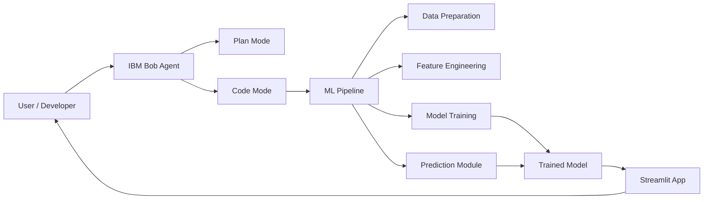
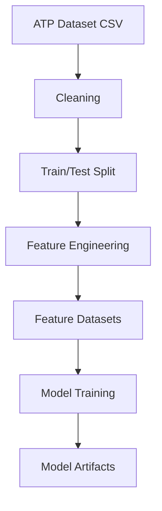
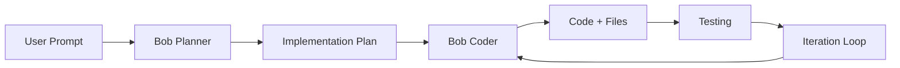
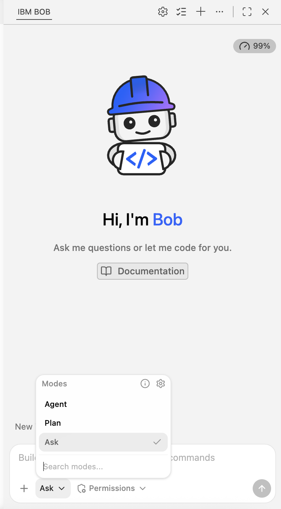
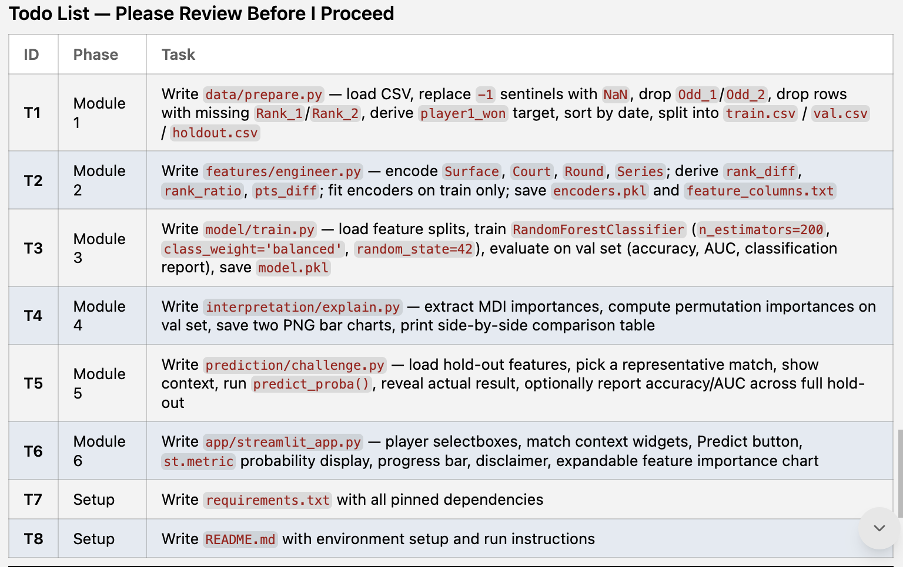

---

## Overview

What if you could predict the outcome of a tennis match before the first serve is even hit? In this lab, you’ll build your own AI-powered match predictor—transforming raw tennis data into real-time insights. From analyzing player rankings to generating win probabilities in an interactive web app, you’ll learn how AI turns sports data into smarter decisions. By the end, you won’t just understand machine learning—you’ll have built a working application you can explore, test, and refine.

---

## Learning Objectives

By the end of the lab, you should be able to:

- Create a comprehensive planning document.
- Build an end-to-end machine learning pipeline.
- Define and prevent data leakage.
- Train and evaluate a Random Forest model.
- Interpret model predictions.
- Deploy a web application.
- Apply the persistent artifacts pattern.

---

## Architecture Diagrams

### 1. High-Level Architecture



---

### 2. Data Pipeline



---

### 3. Agentic Workflow



---

## About this lab

This lab guides you through instructions to design, build, and deploy an end-to-end machine learning solution using real ATP tennis data and IBM Bob, your AI development partner. You’ll start by creating a structured implementation plan, then move through each stage of the machine learning pipeline—including data preparation, feature engineering, model training, and evaluation—while learning how to prevent common pitfalls like data leakage. You’ll also interpret your model’s predictions, validate its performance, and deploy it as an interactive Streamlit web application. Along the way, you’ll gain experience collaborating with an AI assistant, managing development artifacts, and applying modern AI development practices in a real-world scenario.

---

## Estimated time

**75-90 minutes**

## Dataset

This lab uses the [ATP Tennis 2000 - 2026 Daily update](https://www.kaggle.com/datasets/dissfya/atp-tennis-2000-2023daily-pull) dataset. The dataset is structured as a match-level dataset, where each row represents a single tennis match. 

Each record typically includes core match metadata such as:

- Date of the match
- Tournament name and type (e.g., Grand Slam, Masters)
- Round (e.g., quarterfinal, final)
- Match results (scores, winner vs. loser)

The dataset captures details about both competitors in each match:

- Player identities (winner and loser)
- Rankings at the time of the match
- Potential career or tournament-specific context

Many columns focus on in-game performance metrics, for example:

- Sets and games won
- Detailed score breakdowns
- Serve- and return-related stats (varies by source completeness)

The dataset includes contextual metadata such as:

- Surface type (e.g., clay, grass, hard court)
- Tournament category/series
- Location-related information

The following table summarizes the dataset.

  | Field Name | Data Type         | Description                    | Example         |
  | ---------- | ----------------- | ------------------------------ | --------------- |
  | Tournament | String            | Name of the tennis tournament  | "French Open"   |
  | Date       | Date (YYYY-MM-DD) | Date when the match was played | "2018-10-04"    |
  | Series     | String            | Tournament category/tier       | "Grand Slam"    |
  | Court      | String            | Type of court location         | "Outdoor"       |
  | Surface    | String            | Playing surface type           | "Clay"          |
  | Round      | String            | Tournament round               | "Quarterfinals" |
  | Best of    | Integer           | Maximum number of sets         | 5               |
  | Player_1   | String            | First player name              | "Federer R."    |
  | Player_2   | String            | Second player name             | "Nadal R."      |
  | Winner     | String            | Match winner name              | "Nadal R."      |
  | Rank_1     | Integer           | ATP ranking of Player_1        | 3               |
  | Rank_2     | Integer           | ATP ranking of Player_2        | 1               |
  | Pts_1      | Integer           | Ranking points of Player_1     | 5705            |
  | Pts_2      | Integer           | Ranking points of Player_2     | 8770            |
  | Odd_1      | Float             | Betting odds for Player_1      | 2.5             |
  | Odd_2      | Float             | Betting odds for Player_2      | 1.53            |
  | Score      | String            | Final match score              | "6-3 6-7 4-6"   |

***

<a name="top"></a>

## Prerequisites

**Tip:** Right-click the following link, and open the page in a new tab.

Complete the prerequisite tasks of [Get started with IBM Bob](get-started-with-ibm-bob.md)

***

## Contents

- [Task 1: Set up the project](#task01)
- [Task 2: Create an implementation plan](#task02)
- [Task 3: Review the implementation plan](#task03)
- [Task 4: Implement the plan](#task04)
- [Task 5: Understanding Grounded AI (The Most Important Lesson)](#task05)
- [Task 6: Build a Team Formation Visualizer](#task06)
- [Extra Challenges](#challenges)
- [Summary](#summary)
- [Additional resources](#additional-resources)

***

<a name="task01"></a>

# Task 1: Set up the project

Follow these steps to set up the project in IBM Bob.

1. Create a folder for your project with the following name:

   ```
   tennis-predictor
   ```
1. Download the dataset [atp_tennis.csv](https://www.kaggle.com/datasets/dissfya/atp-tennis-2000-2023daily-pull) from Kaggle to the root of the project folder.
1. In IBM Bob, locate the chat side panel.
1. In the Bob chat side panel, select **Agent** mode.

   

1. In IBM Bob, click **File > Open Folder**, select the `tennis-predictor` folder, and click **Open**.
1. Prompt Bob to confirm that you have Python installed.

   ```
   I need to set up a Python development environment which includes pytest. Can you help me verify I have Python installed?

   If installed, notify me with the version.
   If not installed, guide me through installation:
   1. First check if I'm using Mac or Windows.
   2. Detect which shell(s) I'm using (bash, zsh, etc.) and test commands in each to find where tools are available.
   3. Use the appropriate shell for all subsequent commands.
   4. Run the appropriate installation commands.
   5. Explain each command briefly before running it.
   6. Ask for my confirmation before executing each command.

   Note: On macOS, if tools like Homebrew are installed but not found in the default shell, try using interactive shell mode (e.g., `zsh -i -c 'command'`) to load the full environment profile.
   ```

1. To confirm permission to complete the tasks, click **Approve once** when prompted by Bob.

[Back to the top](#top)

***

<a name="task02"></a>

## Task 2: Create an implementation plan


1. In the Bob chat side panel, switch to **Plan** mode.

1. Click **New task**.

1. In Bob's chat panel, copy and paste the following prompt to:
   - Analyze dataset
   - Define architecture
   - Generate plan
   - Use the atp_tennis.csv dataset. **Note:** You must reference the data file using @.


   ```txt
   Build a machine learning web application that predicts the outcome (win probability) of a match between two ATP players.

   The project is structured with these modules:
 
   1. Data preparation (cleaning, feature selection, avoiding data leakage)
   2. Feature engineering (ranking differences, encoding categorical data)
   3. Model building (Random Forest classifier)
   4. Model interpretation (built-in vs. permutation feature importance)
   5. Live prediction challenge (predict a real/held-out match, compare to result)
   6. Web UI dashboard using Streamlit (select two players → see win probabilities)

   Important project constraints:

   * Use Streamlit as the web UI framework for the application.
   * Do not use betting odds as features because they may create data leakage or unrealistic predictive performance.
   * Do not use player names as model features and rely on ranking-based and match-context features instead.
   * Any player names may be used only in the Streamlit UI to allow users to select players for prediction; they must not be included in the feature set used for training.

   Please first inspect ONLY the dataset headers @/atp_tennis.csv and the first ~10 rows. Do not process the full file at this stage.

   Then deliver a plan containing:

   1. PROJECT SETUP
      - DATASET SUMMARY
        - List the columns, their likely data types, and what each represents.
        - Identify the target variable and how to derive it.
        - Flag any columns that risk DATA LEAKAGE (information not known before a match) and explain why.
        - Note any data quality issues you can spot (missing-value sentinels, high-cardinality columns, etc.).
        - Create training, testing, and hold out data.

      - RECOMMENDED TECH STACK
        - Language and version.
        - Core libraries (data handling, ML, model interpretation).
        - Web UI framework — recommend ONE and briefly justify it vs. one alternative.
        - Any supporting tooling (environment/dependency management, testing).
        - Keep it BEGINNER-FRIENDLY and minimal — this is a workshop, not production.

      - PROJECT STRUCTURE
        - Proposed folder/file layout.
        - What each file is responsible for.

   2. MODULE-BY-MODULE BUILD PLAN
      - For each of the 6 modules above: the objective, the key steps, and the expected output/deliverable.

   3. ASSUMPTIONS & OPEN QUESTIONS
      - State any assumptions you're making.
      - List decisions I need to make (e.g., should betting odds be   used as a feature, given they may constitute leakage or market bias?).
      - Note that the dataset is historical only, and explain how   the "live prediction challenge" will work given that constraint.

   4. RISKS & TRADE-OFFS
      - Call out the top 3 risks (e.g., data leakage, time-based vs. random train/test split, high-cardinality   encoding) and your recommended approach for each.

   Create a ToDo list of tasks for my review. 
   ```

1. To confirm permission to complete the tasks, click **Approve once** when prompted by Bob.

[Back to the top](#top)

***

<a name="task03"></a>

## Task 3: Review the implementation plan

Follow these steps to review and approve the implementation plan: 

1. Review the proposed implementation plan. Do not start implementation at this point. Note that your plan might look different than the plan shown in the following image:

   

1. In Bob's chat panel, copy and paste the following prompt ask Bob to create the initial implementation plan document:

   ```
   Approve all the recommendations and create an implementation plan with the file name IMPLEMENTATION_PLAN.MD in Markdown format before starting the coding phase.
   The first phase should be for project setup, then each module is in it's own phase, and a final phase to test the implementation.
   Pause so that I can review the ToDo list before you create an implementation plan document.
   After creating the implementation plan, list the phases from the implementation plan.
   ```
 1. Review the results: 
    - Saved`IMPLEMENTATION_PLAN.md`
    - Updated Todo List:

      
  
1. After review the ToDo list, confirm to Bob that you want to create the implementation plan.

## 🧠 Development Strategy

### Context management

Context management is the process of deliberately curating exactly which files, code snippets, documentation, and architectural guidelines an AI code assistant is allowed to "see" at any given time.

Because code assistants are powered by Large Language Models (LLMs) with a finite context window (the maximum number of tokens or words they can process at once), throwing your entire codebase at them is either impossible, prohibitively expensive, or highly inefficient.

Here is why actively managing what your code assistant "knows" is the most critical skill for getting good results.

### Persistent Artifacts Pattern

The following list shows the most effective approach to context management is the persistent artifacts pattern:

1. **Create artifacts** (files) at each step.
2. **Share artifacts** (upload files).
3. **Restart conversations** with context when needed.
4. **Iterate** until complete.

This approach prevents any single conversation from consuming excessive context while preserving all important information as durable files that can be referenced in future conversations

By creating a persistent implementation plan file in your codebase, you force the AI to read a "source of truth" at the start of every interaction. This guarantees the AI understands the project's current state, what has been completed, and what needs to be done next, regardless of how long the conversation becomes.

[Back to the top](#top)

***

<a name="task04"></a>

## Task 4: Implement the plan

In this task, you will implement the plan through a series of prompts that writes code and then executes the code for each phase of the implementation plan.

- Phase 1: Project setup
- Phase 2: Module 1 - Data preparation
- Phase 3: Module 2 - Feature engineering
- Phase 4: Module 3 - Model training
- Phase 5: Module 4 - Model interpretation
- Phase 6: Module 5 - Live predictions challenge
- Phase 7: Module 6 - Streamlit Web UI
- Phase 8: End-to-end testing and documentation

Follow these steps to prompt Bob to implement the plan: 

1. In the Bob chat side panel, click **New task**
1. Switch to **Agent** mode.
1. Copy and paste the following prompt ask Bob implement the application by executing phases from your implementation plan sequentially.

   ```
   Implement the ATP tennis match prediction web application by executing the implementation plan document, implementation_plan.md, sequentially for each phase. 
   Each module must undergo mandatory testing and review before proceeding to the next phase. 
   All decisions, test results, and any deviations from the plan should be thoroughly documented throughout the implementation process. 
   At the end of each phase, tell me to pause and review the results, and then show me the updated checklist with completed items. 
   At the end of each phase, include a summary of what was implemented, and then pause so that I can review the implementation and approve starting the next phase. 
   Show me an updated ToDo list, sorted by phase, after each phase. 
   Create an phase_x_implementation_log.md file for each phase. 
   ```

1. To confirm permission to complete the tasks, click **Approve once** when prompted by Bob.

In the subsequent phases, Bob creates several Python modules similar to the following files:
   - data_preparation.py
   - feature_engineering.py
   - model_training.py
   - model_interpretation.py
   - prediction.py
   - app.py

[Back to the top of Task 4](#task4)

***

## Phase 1: Project setup

1. Review the ToDo list that Bob created, and click **Approve once** when prompted by Bob.

1. Approve all the subsequent requests to run the required commands and save the files that are being created: (filenames could differ)
   - requirements.txt: 8 core dependencies (pandas, numpy, scikit-learn, matplotlib, seaborn, streamlit, pytest, joblib)
   - config.py: 128 lines of centralized configuration (paths, parameters, settings)
   - README.md: 267 lines of comprehensive documentation
   - .gitignore: 64 lines covering Python, IDEs, virtual environments, and OS files
   - phase_1_implementation_log.md: log file for the implementation of phase 1

[Back to the top of Task 4](#task4)

***

## Phase 2: Module 1 - Data preparation

1. Review the ToDo list that Bob created, and click **Approve once** when prompted by Bob.

1. When prompted, run `data_preparation.py` to create the train, test and holdout datasets.

   Bob creates the following datasets:
   - train.csv
   - test.csv
   - holdout.csv

[Back to the top of Task 4](#task4)

***

## Phase 3: Module 2 - Feature engineering

1. Review the ToDo list that Bob created, and click **Approve once** when prompted by Bob.

1. Run the `feature_engineering.py` module when prompted. 

   If you encounter errors, Bob may suggest fixes.

[Back to the top of Task 4](#task4)

***

## Phase 4: Module 3 - Model training

1. Review the ToDo list that Bob created, and click **Approve once** when prompted by Bob.

1. When prompted, run the `model_training.py` module.

[Back to the top of Task 4](#task4)

***

## Phase 5: Module 4 - Model interpretation

1. Review the ToDo list that Bob created, and click **Approve once** when prompted by Bob.

1. When prompted, run the `model_interpretation.py` module.

[Back to the top of Task 4](#task4)

***

## Phase 6: Module 5 - Model predictions

1. Review the ToDo list that Bob created, and click **Approve once** when prompted by Bob.

1. When prompted, allow Bob to run `prediction.py` module to test the model.

[Back to the top of Task 4](#task4)

***

## Phase 7: Module 6 - Streamlit Web UI

1. Review the ToDo list that Bob created, and click **Approve once** when prompted by Bob.

1. When prompted, allow Bob to run `streamlit_app.py` module to create the web application.

[Back to the top of Task 4](#task4)

***

## Phase 8: End-to-end testing and documentation

During the testing phase, Bob validates:

- Data artifacts
- Model
- Predictions
- Documentation

1. Review the ToDo list that Bob created, and click **Approve once** when prompted by Bob.

   Bob creates:
   - Tests for each of the Python modules
   - Documentation in markdown format

1. Review and run the integration test code that Bob creates.
1. Verify that all tests pass.
1. Approve the updated ToDo list that displays, and review the summary:

   

[Back to the top of Task 4](#task4)

## Final completion

Review the final completion:

   

[Back to the top](#top)

***

<a name="task05"></a>

# Task 5: Test the predictor application

Now that the application is built, follow these steps to test the application:

1. Open the application at [http://localhost:8501](http://localhost:8501) in a browser to try the app.

   1. If the app doesn't run in a browser, ask Bob to launch the app and provide you with the URL to open the app in a browser.

   1. Click **Proceed While Running** to continue.

   1. Select several player match ups and predict the outcomes.

      
   
   1. If you encounter any errors in the app, ask Bob to help you troubleshoot the error. For example:

      ```
      I’m testing the app and after selecting players, I see "Error making prediction: No module named 'feature_engineering’” Can you troubleshoot the cause of the error?
      ```

   1. Optional: Ask Bob to enhance the application with additional features.

***

## Summary

In this lab, you used IBM Bob, your agentic AI development partner, to:

- Built an end-to-end machine learning pipeline using real-world sports data
- Performed data preparation, feature engineering, and model training (Random Forest)
- Evaluated and interpreted model performance using metrics and feature importance
- Developed and deployed an interactive web application using Streamlit
- Applied best practices such as preventing data leakage and validating models
- Collaborated with an AI coding assistant to plan, implement, and test a full application
- Managed development artifacts and documentation using structured workflows

***

<a name="additional-resources"></a>

## Additional resources

- [IBM Bob documentation](https://bob.ibm.com/docs)

[Back to the top](#top)