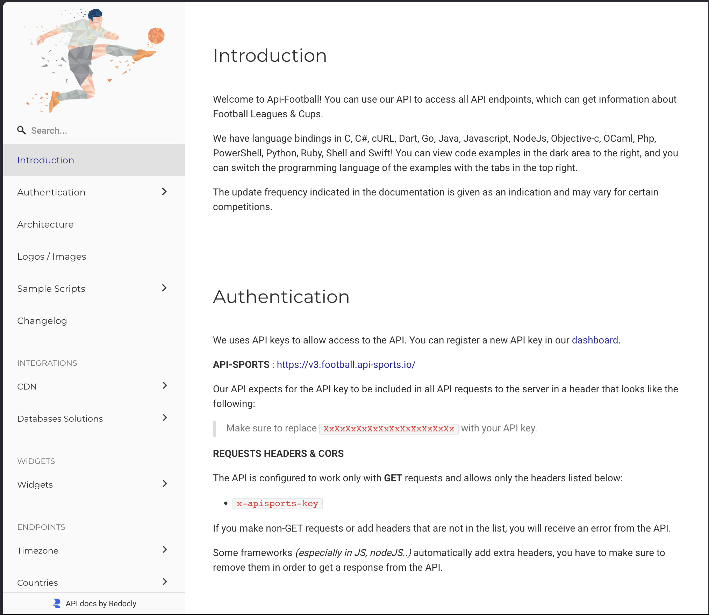
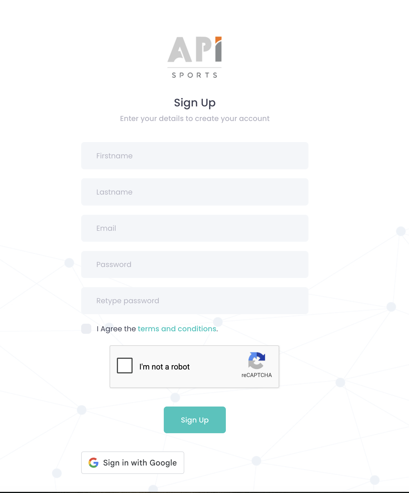
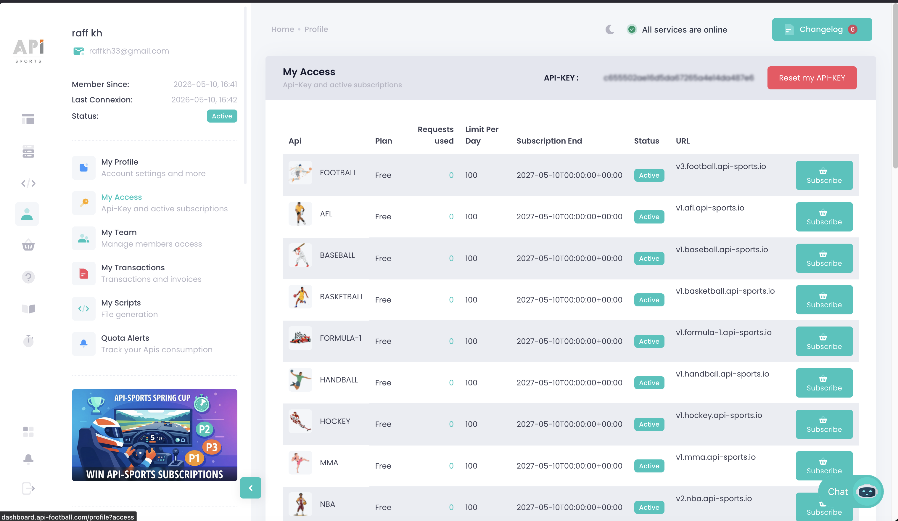

## Steps to Get API Access

> **Note**: This section covers **Option B** from the lab overview. 

### 1. Create an API-Football Account

1. Navigate to [API-Football](https://www.api-football.com/)



2. Click **Sign Up** or **Register**



3. Complete the registration form with:
   - Email address
   - Password
   - Accept terms of service
4. Verify your email address through the confirmation link sent to your inbox


### 2. Access Your API Dashboard

1. Log in to your API-Football account
2. Navigate to the **My Account** section
3. Locate your **API Key** (also called API token) on the top of the **My Access** Section.
4. Copy and securely store your API key



### 3. Review API Limits

The free tier of API-Football includes:
- **100 requests per day**
- Access to basic endpoints (players, teams, fixtures)
- Rate limiting applies

<!--TODO: link to caching? -->


### 4. Test Your API Access (Optional)

To verify your API key works, you can test it using a simple request:

```bash
curl -X GET "https://v3.football.api-sports.io/players?id=276&season=2023" \
  -H "x-apisports-key: YOUR_API_KEY_HERE"
```

Replace `YOUR_API_KEY_HERE` with your actual API key.


---

## Additional Resources

Link to the API Football Documentation: https://www.api-football.com/documentation-v3